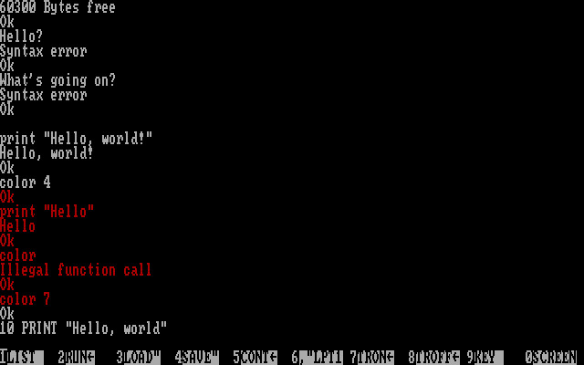
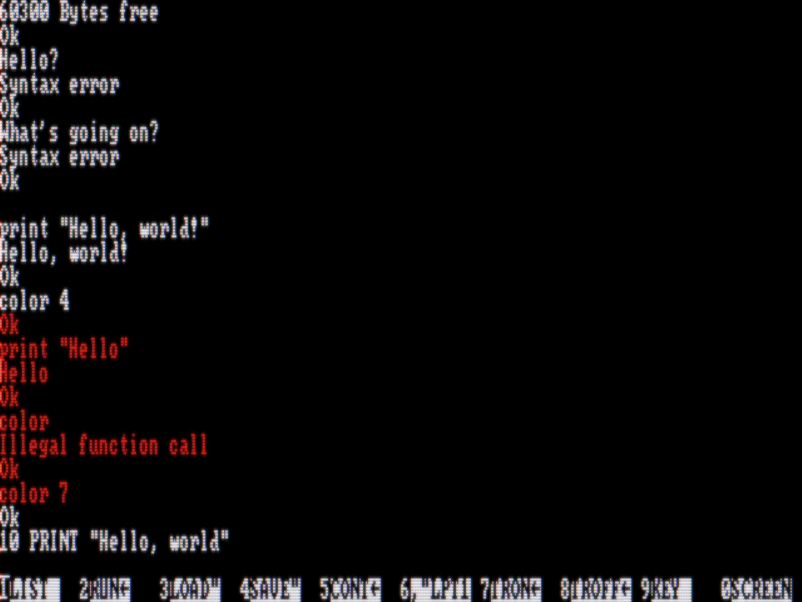
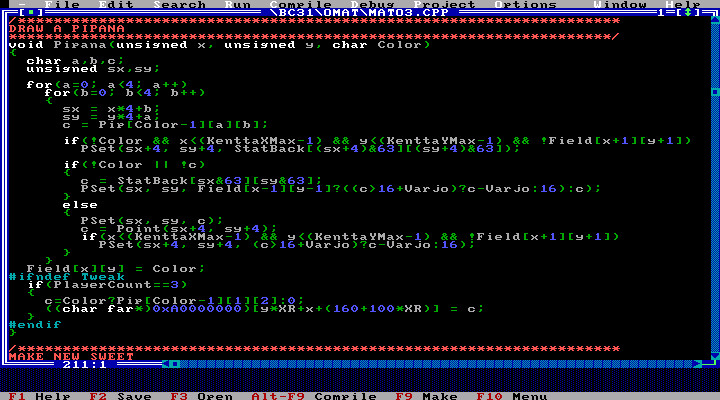
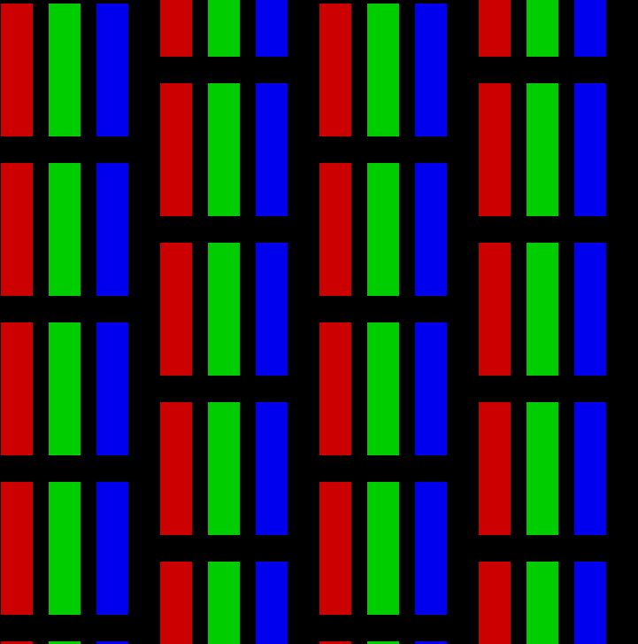

# Bisqwit’s CRT filter

This is the CRT filter that I used in my ”What is That Editor” video,
at https://www.youtube.com/watch?v=ZMBQmhO8KqI.

It received some accolades, but I forgot to publish it.
Here it is finally.

## To build

Run this command to build the filter:

    g++ -o crt-filter crt-filter.cc -fopenmp -Ofast -march=native -Wall -Wextra

## Usage

The filter takes BGRA (RGB32) video (RAW!) from stdin,
and produces BGRA video (RAW!) into stdout.

The filter takes five commandline parameters:

    ./crt-filter <sourcewidth> <sourceheight> <outputwidth> <outputheight> <scanlines>

The sourcewidth and sourceheight denote the size of the original video.
The outputwidth and outputheight denote the size that you want to produce.
Generally speaking you want to produce as high quality as possible.
Vertical resolution is more important than horizontal resolution.

Scanlines is the number of scanlines you wish to simulate.
Generally that would be the same as the vertical resolution of the source video,
but that is not a requirement.

For best quality, the number of scanlines should be chosen
such that the intermediate height (see Hardcoded constants)
is its integer multiple.
The intermediate width should ideally also be an integer
multiple of the source width. None of this is required though.

IMPORTANT: This filter does *not* decode or produce video formats like avi/mp4/mkv/whatever.
It only deals with raw video frames. You need to use an external program,
like ffmpeg, to perform the conversions.
See `make-reencoded.sh` and `reencode.sh` for a practical example.

## Screenshots

## How it works

### Hardcoded constants

These constants specify the pixel grid (shadow mask) used by the simulated CRT monitor.

Currently they are hardcoded in the program,
but they are easy to find if you want to tweak the source code.

The cell widths and heights and staggering specify the geometry of the shadow
mask. See Filtering, below, for an example of what it looks like.

### Hashing

The filter is designed for DOS videos, and specifically for sessions
involving the text mode. Because chances are that successive frames are
identical or almost identical, the filter calculates a hash of every source frame.

If the hash is found to be identical to some previous frame,
the filtered result of the previous frame is sent.
Otherwise, the new frame is processed, and saved into a cache with the hash of the input image.

Four previous unique frames are cached. This accounts e.g. for blinking cursors.

### Converting into linear colors

First, the image is un-gammacorrected.

### Rescaling to scanline count

Then, the image is rescaled to the height of number of given scanlines using a Lanczos filter.
The Lanczos filter has filter width set as 2.

If your source height is greater than the number of scanlines you specified, you will lose detail.

### Rescaling to intermediate size

Next, the image is rescaled to the intermediate width and height using a nearest-neighbor filter.

The scaling is performed first vertically and then horizontally.
Before horizontal scaling, the brightness of each row of pixels
is adjusted by a constant factor that is calculated by

### Filtering

Each color channel and each pixel of the picture — now intermediate width and height — is multiplied by a mask
that is either one or zero, depending on whether that pixel belongs inside a
cell of that color according to the hardcoded cell geometry.

The mask is a repeating pattern that essentially looks like this:

Where red pixels are 1 for red channel, green pixels are 1 for green channel, and blue pixels are 1 for blue channel, and everything else for everyone is 0.

The mask is generated procedurally from the cell parameters.

### Rescaling to target size

Then the image is rescaled to the target picture width and target picture height using a Lanczos filter.
The scaling is performed first vertically and the horizontally.

### Bloom

First, the brightness of each pixel is normalized so that the sum of masks
and scanline magnitudes does not change the overall brightness of the picture.

Then, a copy is created of the picture.
This copy is gamma-corrected and amplified with a significant factor, to promote bloom.

This copy is gaussian-blurred using a three-step box filter,
where the blur width is set as output-width / 640.

Then, the actual picture is gamma-corrected, this time without a brightening factor.

Then, the picture and its blurry copy are added together,
and each pixel is clamped to the target range using a desaturation formula.

### The desaturation formula

The desaturation formula first calculates a luminosity value from the input R,G,B
components using ITU coefficients (see [sRGB on Wikipedia](https://en.wikipedia.org/wiki/SRGB)):

* If the luminosity is less than 0, black is returned.
* If the luminosity is more than 1, white is returned.
* Otherwise, a saturation value is initialized as 1, and then adjusted by inspecting each color channel value separately:

After analyzing all color channels,
if the saturation still remains as 1, the input color is returned verbatim.
Otherwise each color channel is readjusted as:

The readjusted color channel values are then joined together to form the returned color.
